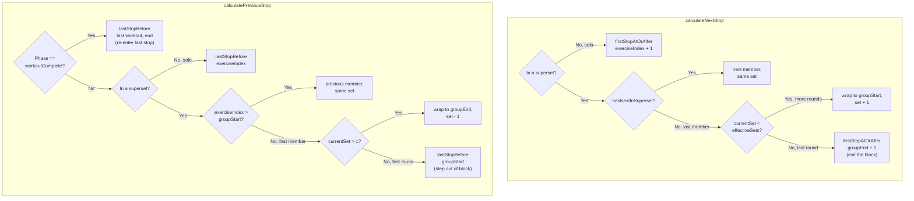

# Session State Machine

Documents the pure transition logic in
[`lib/providers/session_state_machine.dart`](../../lib/providers/session_state_machine.dart).
`SessionStateMachine` holds the side-effect-free decisions of a running
session: *given where we are, what's next, and how long does it last?*
`SessionStateProvider` owns the mutable state and timer; it calls into this
class on every phase boundary.

There are **two distinct models** here, and they're easy to conflate:

1. **The phase cycle** — what the timer does tick to tick (`calculateNextState`
   + `getDurationForPhase`). This is automatic, time-driven progression.
2. **The stop-navigation model** — what the bottom-bar next/previous buttons do
   (`calculateNextStop` / `calculatePreviousStop`). This jumps between
   *exercises the user physically performs*, deliberately skipping the
   intermediate rest phases.

They share the same `SessionProgress` shape but answer different questions.

> Keep this in sync with the code. The tests in
> [`test/providers/session_state_machine_test.dart`](../../test/providers/session_state_machine_test.dart)
> assert most of the edges below — if you change a transition, a test should
> change too, and so should this doc.

---

## 1. The phase cycle (`calculateNextState`)

This is the per-tick progression. Each `TimerPhase` runs for
`getDurationForPhase` seconds, then the timer asks `calculateNextState` what
comes next. Branch conditions live on the edges.

Key terms used in the edge labels:

- **effectiveSets** — `supersetSets` for a superset member, else the exercise's
  own `sets` (`setsForExerciseInWorkout`).
- **hasNextInSuperset** — the current exercise is a superset member that is
  *not* the last in its block, so another member follows in this round.
- **last member + more rounds** — last member of a superset block, but
  `currentSet < effectiveSets`, so the block repeats.

```mermaid
stateDiagram-v2
    [*] --> getReady

    getReady --> rep

    rep --> repRest: timedReps, reps remain, gap > 0
    rep --> rep: timedReps, reps remain, gap == 0 (skip)
    rep --> supersetRest: fixedDuration, hasNextInSuperset
    rep --> setRest: fixedDuration, more sets, solo
    rep --> exerciseRest: fixedDuration, last set, no next member

    repRest --> rep: reps remain (currentRep + 1)
    repRest --> supersetRest: last rep, hasNextInSuperset
    repRest --> setRest: last rep, more sets, solo
    repRest --> exerciseRest: last rep, last set, no next member

    setRest --> rep: more sets (currentSet + 1)
    setRest --> exerciseRest: last set (next exercise)

    supersetRest --> rep: next member, same set

    exerciseRest --> rep: within workout
    exerciseRest --> getReady: cross-workout (set 1, exercise 0)

    exerciseRest --> [*]: no more exercises (null)
    setRest --> [*]: no more exercises (null)

    rep --> [*]: manual type (null; advanceManually drives)

    note right of supersetRest
        Between MEMBERS of a superset round.
        Duration = SupersetConfig.restSeconds.
    end note

    note right of exerciseRest
        Two duties:
        - between exercises (currentSet == 1):
          workout.timeBetweenExercises
        - between superset ROUNDS (currentSet > 1):
          supersetSetRest, falling back to
          timeBetweenExercises. Entered via
          enterPostSetRest with exerciseIndex
          pulled back to the group's first member.
    end note
```

(In the labels above, "gap" is `timeBetweenReps`. The `setRest` and
`exerciseRest` transitions for the solo/last-member cases route through
`enterPostSetRest` and `enterExerciseRest` respectively.)

### Phases reached outside the cycle

`overtime` and `paused` are **not** produced by `calculateNextState` — they're
entered by explicit provider actions and exit back into the cycle:

- **`paused`** — `pause()` remembers the current phase and parks here;
  `resume()` restores it. `calculateNextState(paused)` returns null.
- **`overtime`** — `requestManualOvertime()` (or automatic rest-overtime on
  background) enters it from an overtime-eligible phase (`setRest`,
  `exerciseRest`, `getReady` — see `isOvertimeEligible`). `exitOvertime()`
  resumes by running `calculateNextState` against the *remembered source phase*,
  so the session continues as if the rest had ended normally.

### Durations at a glance (`getDurationForPhase`)

| Phase | Duration source |
|-------|-----------------|
| `rep` (timedReps) | `exercise.timePerRep` |
| `rep` (fixedDuration) | `exercise.activeTime` |
| `rep` (manual) | `Duration.zero` (waits for the user) |
| `repRest` | `exercise.timeBetweenReps` |
| `setRest` | `exercise.timeBetweenSets` |
| `supersetRest` | `SupersetConfig.restSeconds` (fallback 15s) |
| `exerciseRest`, between exercises | `workout.timeBetweenExercises` |
| `exerciseRest`, between superset rounds | `SupersetConfig.supersetSetRest` ?? `workout.timeBetweenExercises` |
| `getReady` | 10s |
| `overtime`, `paused`, `workoutComplete` | `Duration.zero` |
| any phase, null session | `Duration.zero` |

The load-bearing line: the `exerciseRest` branch checks
`superset != null && currentSet > 1` to tell a normal between-exercise rest
apart from a between-rounds superset rest.

---

## 2. The stop-navigation model (`nextStop` / `previousStop`)

The bottom bar's next/previous buttons don't step through phases — they jump to
the next/previous *exercise the user actually performs*. Sets are **not** stops
for a solo exercise (it's the same exercise repeated), but each superset member
*is* a stop, and rounds matter. Stops always land on `rep` (or `getReady` when
crossing into a later workout's first exercise).

### The two helpers both branches lean on

- **`firstStopAtOrAfter(workoutIndex, index)`** — the stop at exercise `index`,
  rolling into the next workout's first exercise (`getReady`) if `index` runs
  off the end, or `null` if the session is exhausted.
- **`lastStopBefore(workoutIndex, index)`** — the stop at `index - 1`. When that
  previous exercise is a superset member, it lands on the **group's last member
  at its final round** (`groupEnd`, `currentSet = effectiveSets`), so a single
  back-press from outside the block enters at its natural "previous step."
  Rolls back into the previous workout's last exercise (`getReady`) on underflow,
  or `null` at the very start.

---

## Why this is extracted

These functions are pure — output depends only on `(SessionProgress, Session)`,
no fields, no notifications. That's what lets them be unit-tested in isolation
(44 cases and counting) and reused: the `SoundDispatcher`'s future-beep walk
simulates upcoming phases by calling `calculateNextState` repeatedly without
touching live session state.
